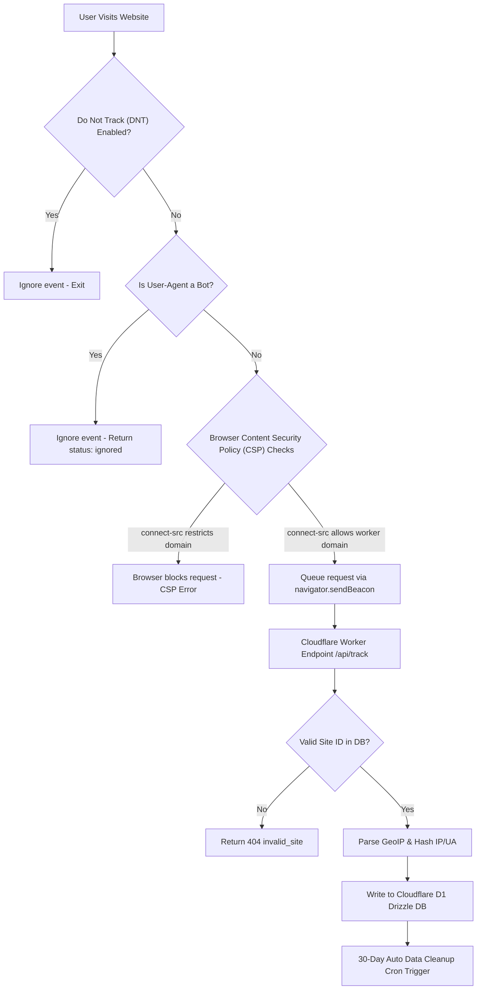

# ◐ PrismAnalytics — Privacy-first, Cookie-free Analytics

**Version:** `1.0.0` — *First Light* — 2026-07-10


> Cookie-free, GDPR-friendly, self-hostable analytics that lives 100% in your Cloudflare account. No third-party. No fingerprint. No selling data.

**[🚀 Live Demo](#) • [📚 Docs](./docs/README.md) • [🔒 Audit Report](./docs/AUDIT-REPORT.md) • [🌍 Privacy Policy](./docs/08-PRIVACY/PRIVACY-POLICY.md)**

---

## 🎯 What You Get

```
Your Website (any stack) ──► Your Worker ──► Your D1 SQLite ──► Your Dashboard
                               (no Google, no Facebook, no one else sees data)
```

| Principle | How |
|-----------|-----|
| **No cookies** | Session UUID in `sessionStorage` (tab-only) |
| **No IP stored** | `SHA256(IP\|UA\|dailySalt)` only — raw IP discarded in memory |
| **No fingerprint** | No canvas/WebGL/fonts enumeration |
| **No third party** | D1 + KV + R2 all in your account |
| **Your data** | Export CSV/JSON, cascade delete anytime |

---

## ✨ Features v1.0.0

| Area | Features |
|------|----------|
| **Tracking** | Pageviews, custom events `window.prism('purchase', {value:99})`, UTM auto-capture |
| **Real-time** | Live visitors (5-min window), polling every 10s, active pages with pulse dot |
| **Analytics** | Timeline 7/30/90 days, top pages, referrers, countries, devices, browsers, OS |
| **Map** | Interactive SVG world map — 60+ countries, hover tooltip with flag + views + %, heat intensity |
| **Frameworks** | 13 templates: HTML, Bootstrap, React, Next.js, Vue, Nuxt, Angular, Svelte, GTM, WordPress, Shopify, Webflow, Wix |
| **Security** | MX verification via Cloudflare DoH, disposable email block (24+), PBKDF2 210k + timingSafeEqual, JWT HS256 + session revocation + 7d expiry, DB rate limiting (5/h signup, 10/15m login, 300/m track), account lockout 5→15m, bot detection 30+ patterns, malicious pattern (SQLi/XSS/traversal), CSP+HSTS+X-Frame, audit log, password strength meter |
| **UI** | Dark theme default, responsive 320px→4k, toast notifications, confirmation modals, PWA + favicon + OG image, fully working buttons |
| **Export** | CSV/JSON up to 50k rows, safe slug filename, audited |
| **Deletion** | Site cascade, account cascade (user→sites→pageviews→sessions→audit) |

---

## 📸 Screenshots (Conceptual)

```
┌─────────────────────────────────────────────────────────────────┐
│  ◐ PrismAnalytics — Overview                    [example.com ▼] │
│  ┌──────────┐ ┌──────────┐ ┌──────────┐ ┌──────────┐            │
│  │ 24,892   │ │ 18,429   │ │ 42.3%    │ │ 12 live  │            │
│  │ pageviews│ │ visitors │ │ bounce   │ │ now      │            │
│  └──────────┘ └──────────┘ └──────────┘ └──────────┘            │
│  ┌───────────────────────────────────────────────────┐           │
│  │  Traffic overview (Area chart, purple + coral)   │           │
│  └───────────────────────────────────────────────────┘           │
│  ┌──────────────┐ ┌──────────────┐                                │
│  │ Top pages    │ │ Top sources  │                                │
│  └──────────────┘ └──────────────┘                                │
│  ┌─────────────────────────┐ ┌──────────┐                         │
│  │ World map (60 countries)│ │ Devices  │                         │
│  └─────────────────────────┘ └──────────┘                         │
└─────────────────────────────────────────────────────────────────┘
```

See [docs/VISUAL-GUIDE.md](./docs/VISUAL-GUIDE.md) for edit locations.

---

## ⚡ Quickstart (5 min — no Cloudflare account needed for local preview)

```bash
git clone https://github.com/yourusername/prism-analytics.git
cd prism-analytics
cp .env.example .env
# Edit .env: DATABASE_URL + JWT_SECRET (min 32 chars)
npm install
npx drizzle-kit push --config drizzle.config.json
npm run dev
# Open http://localhost:3000 → Signup → Add site → Copy tracking code
```

Test tracking:

```bash
curl -X POST http://localhost:3000/api/track \
  -H "Content-Type: application/json" \
  -H "User-Agent: Mozilla/5.0" \
  -d '{"site_id":"pa_test","pathname":"/","referrer":""}'
```

---

## 🚀 Deploy to Cloudflare (One-Click Automated Setup)

We provide a FormForge-inspired **1-Click Setup (`npm run setup`)** that deploys the Worker, automatically provisions the free D1 SQLite database, applies/self-bootstraps the schema, securely stores an optional JWT secret, builds assets, and deploys—without R2, a credit card, or resource-ID copy/paste.

### Option A: One-Click Interactive CLI Setup (`npm run setup` — Recommended)

Run a single command inside your terminal:

```bash
npm install
npm run setup
```

**What `setup.js` does automatically for you:**
1. Checks Cloudflare authentication (`wrangler login`).
2. Prompts for your preferred Worker/App Name (`prism-analytics`).
3. Deploys with Wrangler 4 automatic D1 provisioning—no `database_id` is committed or copied.
4. Applies D1 SQLite migrations; the Worker also self-bootstraps safely on first API request.
5. Generates a secure 48-byte `JWT_SECRET` and stores it in Cloudflare encrypted secrets when available; secure D1-backed key fallback keeps one-click deploy functional.
6. Builds optimized frontend assets (`vite build`) and deploys (`wrangler deploy`).
7. Displays your live dashboard URL. No R2 or KV subscription is required.

---

### Option B: Cloudflare One-Click Web Deploy Button

[](https://deploy.workers.cloudflare.com/?url=https://github.com/SudhirDevOps1/PrismAnalytics)

---

### Option C: Manual CLI Step-by-Step

If you prefer provisioning each resource manually command-by-command:

```bash
npx wrangler login
npx wrangler login
npx vite build
npx wrangler deploy                                # automatically provisions D1
npx wrangler d1 migrations apply DB --remote       # optional; Worker self-bootstraps
npx wrangler secret put JWT_SECRET                 # optional hardening override
```

Full guide: [docs/09-DEPLOYMENT.md](./docs/09-DEPLOYMENT.md) + [docs/10-ENV-VARIABLES.md](./docs/10-ENV-VARIABLES.md)

---

## 🔧 Tracking Snippet — 13 Frameworks

Dashboard → Sites → select site → 13 tabs:

| Framework | Where to paste | Visual Guide |
|-----------|---------------|--------------|
| HTML / Static | `<head>` before `</head>` | [html.md](./docs/07-INTEGRATIONS/html.md) |
| Bootstrap 5 | `index.html` / `header.php` | [bootstrap.md](./docs/07-INTEGRATIONS/bootstrap.md) |
| React | `PrismInit.tsx` on mount | [react.md](./docs/07-INTEGRATIONS/react.md) |
| Next.js | `app/layout.tsx` `afterInteractive` | [nextjs.md](./docs/07-INTEGRATIONS/nextjs.md) |
| Vue 3 | `main.ts` plugin | [vue.md](./docs/07-INTEGRATIONS/vue.md) |
| Nuxt 3 | `plugins/prism.client.ts` | [nuxt.md](./docs/07-INTEGRATIONS/nuxt.md) |
| Angular | `PrismService` | [angular.md](./docs/07-INTEGRATIONS/angular.md) |
| Svelte | `$lib/prism.ts` | [svelte.md](./docs/07-INTEGRATIONS/svelte.md) |
| GTM | Custom HTML All Pages | [gtm.md](./docs/07-INTEGRATIONS/gtm.md) |
| WordPress | `functions.php` `wp_head` | [wordpress.md](./docs/07-INTEGRATIONS/wordpress.md) |
| Shopify | `theme.liquid` | [shopify.md](./docs/07-INTEGRATIONS/shopify.md) |
| Webflow | Site Settings Custom Code | [webflow.md](./docs/07-INTEGRATIONS/webflow.md) |
| Wix | Tracking Tools Custom | [wix.md](./docs/07-INTEGRATIONS/wix.md) |

Custom events everywhere:

```js
window.prism('purchase_completed', { value: 99, currency: 'USD' });
window.prism('newsletter_signup', { source: 'footer' });
```

Full guide: [docs/06-TRACKING-SCRIPT.md](./docs/06-TRACKING-SCRIPT.md)

---

## 📊 API — 13 Endpoints

| Method | Path | Auth | Purpose |
|--------|------|------|---------|
| POST | `/api/auth/signup` | no, 5/h | MX + disposable + strength + audit |
| POST | `/api/auth/login` | no, 10/15m | lockout + timing-safe + audit |
| POST | `/api/auth/logout` | Bearer | Revokes JWT |
| POST | `/api/auth/check-email` | no, 30/m | Live MX badge |
| GET | `/api/auth/me` | Bearer | Current user |
| GET | `/api/sites` | Bearer | Tenant-scoped list |
| POST | `/api/sites` | Bearer | Create + audit |
| DELETE | `/api/sites/[id]` | Bearer | Cascade delete |
| POST | `/api/track` | public, 300/m | Bot-filtered, 1×1 GIF |
| GET | `/api/analytics` | Bearer | Timeline, ranked metrics |
| GET | `/api/analytics/live` | Bearer | 5-min live |
| GET | `/api/analytics/export` | Bearer | CSV/JSON download |
| DELETE | `/api/account` | Bearer | Full cascade wipe |
| GET | `/api/health` | no | ok |
| GET | `/api/version` | no | version + changelog |

Data lineage: [docs/05-API-REFERENCE.md#data-tables](./docs/05-API-REFERENCE.md) shows which SQL powers each UI section.

Full ref: [docs/05-API-REFERENCE.md](./docs/05-API-REFERENCE.md)

---

## 🔒 Privacy & Compliance

| Doc | Purpose |
|-----|---------|
| [Privacy Policy](./docs/08-PRIVACY/PRIVACY-POLICY.md) | What we collect / don't, retention, rights |
| [Cookie Policy](./docs/08-PRIVACY/COOKIE-POLICY.md) | Zero cookies proof |
| [GDPR Checklist](./docs/08-PRIVACY/GDPR-COMPLIANCE.md) | Art 5, 6, 13, 17, 25, 28, 30, 35, ePrivacy |
| [DPA Template](./docs/08-PRIVACY/DPA.md) | If hosting for clients |
| [Data Deletion](./docs/08-PRIVACY/DATA-DELETION.md) | UI + API + SQL ways |

**Privacy model:**

```
Visitor IP + UA (memory only)
  → dailySalt = sha256(JWT_SECRET + YYYY-MM-DD).slice(0,32)
  → user_hash = SHA256(IP|UA|salt)
  → stored, IP & UA discarded
  → salt rotates daily → cannot correlate across days
```

No IP, no UA, no cookies, no fingerprint stored.

---

## ☁️ Cloudflare Free Tier & Storage Options

PrismAnalytics is designed to run **100% free** under the Cloudflare Workers & D1 Database Free Tiers:

* **Free Tier Limits**:
  - **D1 Database**: 5 Million read rows per day, 100,000 write rows per day, and up to 500MB total SQLite storage.
  - **Pageviews Tracking**: Practically allows you to track around **100,000 pageviews/events per month** completely free.
  
* **Data Retention & Auto-Pruning**:
  - To remain safely within D1 database free storage limits, historical raw pageview logs are **automatically pruned after 30 days** by default (configurable up to 90 days or 1 year).
  
* **Optional S3/R2 Backup (Historical Archiving)**:
  - Storage configuration is **completely optional**.
  - If you configure a Cloudflare R2 bucket or S3-compatible service (Backblaze B2, Wasabi, Storj, IDrive e2, MinIO, AWS S3, etc.), you can archive your historical logs permanently past the 30-day D1 limit.
  - When configured in environment variables, the dashboard settings page will automatically show **Connected** with your storage provider details. If absent, it displays **D1 Only**.

---

## 📁 Project Structure (as requested)

```
prism-analytics/
├── .github/workflows/deploy.yml        # CI/CD
├── migrations/0001_initial.sql         # D1 schema (SQLite)
├── public/
│   ├── favicon.ico, apple-touch-icon.png, og-image.png
│   ├── manifest.json                   # PWA
│   ├── robots.txt, sitemap.xml
│   └── icons/icon-16...512.png
├── docs/                               # 20+ MD files
│   ├── 00-OVERVIEW.md ... 12-TROUBLESHOOTING.md
│   ├── 07-INTEGRATIONS/ (13 frameworks)
│   ├── 08-PRIVACY/ (5 policies)
│   ├── AUDIT-REPORT.md, VISUAL-GUIDE.md, etc.
│   └── README.md (hub)
├── src/
│   ├── app/                            # Next.js 16 (preview + prod)
│   │   ├── api/ (13 routes)            # auth, sites, track, analytics, etc.
│   │   ├── components/ (Dashboard, Login, SiteSettings, TrackingScript, WorldMap + ui/*)
│   │   ├── hooks/ (useAuth, useAnalytics)
│   │   ├── lib/api-client.ts
│   │   └── globals.css (dark theme)
│   ├── worker/                         # Cloudflare Worker (Hono) reference for deploy
│   │   ├── index.ts, routes/*, db/*, storage/r2.ts, utils/*, env.ts
│   ├── db/schema.ts                    # PG for Next preview
│   ├── lib/ (security.ts, auth-helpers.ts, bot-detection.ts, version.ts, utils.ts)
│   ├── shared/types.ts
│   └── proxy.ts                        # Security headers + CSP + bot filter
├── wrangler.toml                       # automatic D1 SQLite + assets; no R2
├── package.json                        # v1.0.0
├── vite.config.ts, tailwind.config.js
├── .env.example
└── LICENSE (MIT)
```

---

## 🛡️ Security Audit — v1.0.0

**Audited 2026-07-10 — Production Ready**

| Severity | Before | After |
|----------|--------|-------|
| Critical | 6 | 0 fixed |
| High | 8 | 0 fixed |
| Medium | 12 | 0 fixed |

Highlights:
- Package renamed, MIT licensed
- JWT session revocation via `sessions` table
- DB-backed rate limiting (not in-memory)
- Account lockout + timing-safe compare
- MX/DNS verification + disposable block + strength meter
- Bot 30+ patterns + SQLi/XSS/traversal detection
- CSP + HSTS + X-Frame + audit log
- Favicon/PWA icons
- All buttons working, responsive

Full report: [docs/AUDIT-REPORT.md](./docs/AUDIT-REPORT.md)

---

## 📝 How to Edit Anything (Visual)

See [docs/VISUAL-GUIDE.md](./docs/VISUAL-GUIDE.md) — every customization with file path:

| Want to change | File |
|----------------|------|
| Colors / theme | `src/app/globals.css` @theme |
| Logo / icon | `public/icon.png` + `public/icons/*` |
| App name | `layout.tsx`, `manifest.json`, `version.ts`, `package.json` |
| Auth rules | `src/lib/security.ts` |
| Rate limits | `auth-helpers.ts` + route files |
| Tracking payload | `api/track/route.ts` + `TrackingScript.tsx` |
| DB schema | `src/db/schema.ts` + `migrations/*.sql` |
| CSP headers | `src/proxy.ts` |
| Version | `src/lib/version.ts` + `package.json` |

---

## 📊 Event Lifecycle & Content Security Policy (CSP)

Here is how tracking events are validated by the browser, filtered by the edge worker, and saved to the database:



### Allowing CORS & CSP in Web Applications

To prevent the browser from blocking requests (like `Refused to connect because it violates the Content Security Policy`), the website hosting the tracking snippet **must** allow the worker domain in its CSP header configuration:

```http
Content-Security-Policy: connect-src 'self' ws: wss: https://prismanalytics.sudhirdevops1.workers.dev;
```

Our Cloudflare Worker contains a built-in CORS middleware that automatically handles and permits cross-origin `OPTIONS` and `POST` requests.

---

## 🌍 Version

**v1.1.0** Prism Refraction — 2026-07-15 — stable channel

```bash
curl http://localhost:3000/api/version
# {"version":"1.1.0","name":"Prism Refraction","buildDate":"2026-07-15","changelog":[...]}
```

Changelog & upgrade: [docs/11-VERSIONING.md](./docs/11-VERSIONING.md)

---

## 🤝 Contributing

1. Fork → feature branch → PR to `main`
2. `npm run typecheck && npm run build` must pass
3. Update `docs/` if you add framework or policy
4. Add entry to `src/lib/version.ts` CHANGELOG


---

## 🚀 Future Roadmap & Update Ideas (भविष्य के लिए सुझाव)

जब भी आप आगे कोई नया फीचर जोड़ना चाहें, तो ये **5 कमाल के सुझाव** हैं जिन्हें आप अपने ऐप में बढ़ा सकते हैं:

1. **Email Alerts & Reports (साप्ताहिक ईमेल)**:
   * क्लाउडफ्लेयर के क्रॉन ट्रिगर (Cron Trigger) का उपयोग करके सीधे यूज़र के ईमेल पर साप्ताहिक ट्रैफिक रिपोर्ट और अचानक आए बड़े ट्रैफिक स्पाइक (Spike Alerts) के ईमेल अलर्ट्स भेजना।
2. **Shareable Public Dashboards (पब्लिक लिंक)**:
   * अपने क्लाइंट्स या टीम के साथ किसी साइट के आंकड़े शेयर करने के लिए एक **Read-Only सुरक्षित लिंक** जनरेट करने का फीचर।
3. **Slack / Discord Webhooks Integration**:
   * जब भी आपकी साइट पर कोई कस्टम इवेंट फ़ायर हो (जैसे- `purchase_completed`), तो आपके Discord या Slack चैनल पर तुरंत नोटिफिकेशन भेजने का फीचर।
4. **Regional/City-Level Maps (शहर के अनुसार मैप)**:
   * अभी मैप में सिर्फ देश (Country) दिखता है, क्लाउडफ़्लेयर के हेडर से सिटी-लेवल डेटा निकालकर सटीक राज्यों और शहरों का डेटा दिखाना।
5. **Click Heatmaps (क्लिक हीटमैप)**:
   * पेज पर यूज़र कहाँ-कहाँ क्लिक कर रहे हैं, उसका एक विज़ुअल नक्शा (anonymized heatmaps) तैयार करना जो पूरी तरह से कुकी-फ़्री हो।

---

## 📜 License

MIT — see [LICENSE](./LICENSE)

---

**Built with 🟣 by PrismAnalytics Team — Your data, your rules.**
