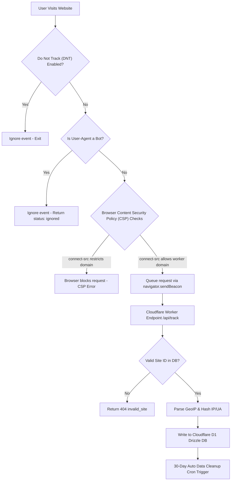

# 🔒 PrismAnalytics integration & Security Guide (add.md)

This document provides a detailed breakdown of browser-side security restrictions, Content Security Policy (CSP) rules, and system limitations.

---

## 📊 Complete Event Lifecycle & Validation Flow

Here is how a tracking request is generated, validated by the browser, filtered by the edge worker, and saved to the database:



---

## 🛡️ Content Security Policy (CSP) Directives

A Content Security Policy (CSP) is a security header designed to prevent Cross-Site Scripting (XSS) and injection attacks. By default, modern frameworks block requests to external URLs unless they are explicitly authorized.

### The Problem
If the website hosting the tracking script has a CSP directive like:
```http
Content-Security-Policy: connect-src 'self' ws: wss:;
```
The browser will instantly block the tracking snippet from calling `https://prismanalytics.sudhirdevops1.workers.dev`.

### The Fix
To allow analytics and widget tracking, the website owner **must** append the PrismAnalytics worker domain to the `connect-src` list:

```http
Content-Security-Policy: connect-src 'self' ws: wss: https://prismanalytics.sudhirdevops1.workers.dev;
```

---

## ⚠️ Core System Restrictions & Limitations

To maintain a lightweight edge operation and comply with global privacy standards, PrismAnalytics enforces the following limitations:

| Feature/Metric | Limitation Rule | Reason |
| :--- | :--- | :--- |
| **Data Retention** | Automatic deletion after **30 days** | Keeps D1 database storage small, fast, and free. |
| **Tracking Cookies** | **0% Cookies** used | No cookie consent banner required. GDPR/CCPA compliant out-of-the-box. |
| **Bot Traffic** | Automatically ignored | Crawler agents (Googlebot, curl, headless tools) are dropped before database insertion. |
| **IP Logging** | SHA256 hashed daily | Raw IP addresses are **never** stored or written to disk. |
| **Device Testing** | Bypassed on local files | The tracking script will fail on `file:///` protocols. Must run on `http://localhost` or a web server. |

---

## 🔧 Multi-Framework Integration Examples

### React / Next.js
If using React or Next.js, implement the tracking script client-side to ensure it is not blocked by Server-Side Rendering (SSR):

```javascript
import { useEffect } from 'react';

export function useAnalytics(siteId, workerUrl) {
  useEffect(() => {
    if (typeof window === 'undefined') return;
    
    const sid = sessionStorage.getItem('pa_sid') || crypto.randomUUID();
    sessionStorage.setItem('pa_sid', sid);
    
    const track = (event = 'pageview', data = null) => {
      navigator.sendBeacon(`${workerUrl}/api/track`, JSON.stringify({
        site_id: siteId,
        pathname: window.location.pathname,
        referrer: document.referrer,
        screen_size: `${window.screen.width}x${window.screen.height}`,
        session_id: sid,
        event_name: event,
        event_data: data
      }));
    };
    
    window.prism = track;
    track('pageview');
  }, [siteId, workerUrl]);
}
```
