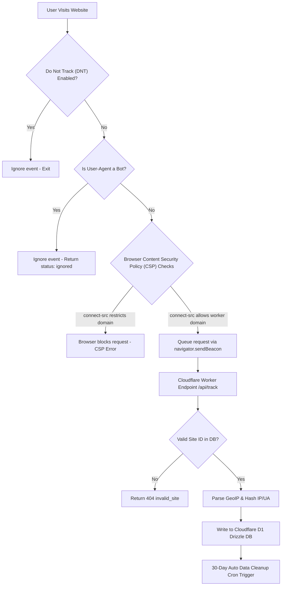

# 🔒 PrismAnalytics Integration & Security Guide (easy_deploy.md)

This document provides a detailed breakdown of browser-side security restrictions, Content Security Policy (CSP) rules, and system limitations.

---

## 📊 Complete Event Lifecycle & Validation Flow

Here is how a tracking request is generated, validated by the browser, filtered by the edge worker, and saved to the database:



---

## 🛡️ Content Security Policy (CSP) Directives

A Content Security Policy (CSP) is a security header designed to prevent Cross-Site Scripting (XSS) and injection attacks. By default, modern frameworks block requests to external URLs unless they are explicitly authorized.

### The Problem
If the website hosting the tracking script has a CSP directive like:
```http
Content-Security-Policy: connect-src 'self' ws: wss:;
```
The browser will instantly block the tracking snippet from calling `https://prismanalytics.sudhirdevops1.workers.dev`.

### The Fix
To allow analytics and widget tracking, the website owner **must** append the PrismAnalytics worker domain to the `connect-src` list:

```http
Content-Security-Policy: connect-src 'self' ws: wss: https://prismanalytics.sudhirdevops1.workers.dev;
```

---

## ⚠️ Core System Restrictions & Limitations

To maintain a lightweight edge operation and comply with global privacy standards, PrismAnalytics enforces the following limitations:

| Feature/Metric | Limitation Rule | Reason |
| :--- | :--- | :--- |
| **Data Retention** | Automatic deletion after **30 days** | Keeps D1 database storage small, fast, and free. |
| **Tracking Cookies** | **0% Cookies** used | No cookie consent banner required. GDPR/CCPA compliant out-of-the-box. |
| **Bot Traffic** | Automatically ignored | Crawler agents (Googlebot, curl, headless tools) are dropped before database insertion. |
| **IP Logging** | SHA256 hashed daily | Raw IP addresses are **never** stored or written to disk. |
| **Device Testing** | Bypassed on local files | The tracking script will fail on `file:///` protocols. Must run on `http://localhost` or a web server. |

---

## 🔧 Multi-Framework Integration Examples

### React / Next.js
If using React or Next.js, implement the tracking script client-side to ensure it is not blocked by Server-Side Rendering (SSR):

```javascript
import { useEffect } from 'react';

export function useAnalytics(siteId, workerUrl) {
  useEffect(() => {
    if (typeof window === 'undefined') return;
    
    const sid = sessionStorage.getItem('pa_sid') || crypto.randomUUID();
    sessionStorage.setItem('pa_sid', sid);
    
    const track = (event = 'pageview', data = null) => {
      navigator.sendBeacon(`${workerUrl}/api/track`, JSON.stringify({
        site_id: siteId,
        pathname: window.location.pathname,
        referrer: document.referrer,
        screen_size: `${window.screen.width}x${window.screen.height}`,
        session_id: sid,
        event_name: event,
        event_data: data
      }));
    };
    
    window.prism = track;
    track('pageview');
  }, [siteId, workerUrl]);
}
```

---

## 🧩 Live Stats Widget Embedding & Requirements

The Live Stats Widget displays real-time active visitors and total pageviews counts directly on your target website.

### 📋 Integration Requirements
1. **DOM Elements**: The target page's HTML must contain elements with specific IDs for values to be inserted:
   - `id="prism-widget-count"`: Holds the live visitors number.
   - `id="prism-widget-total"`: Holds the total pageviews number.
2. **CORS & CSP Headers**: The website hosting the widget must allow HTTP `connect-src` fetch requests to your worker's domain.
3. **Endpoint URL**: The fetch script must query `/api/widget?siteId=YOUR_SITE_ID` from your worker domain.

### 💻 Copy-Paste HTML Widget Snippet
Insert this complete block anywhere in your website's body:

```html
<!-- Live Visitor Widget Container -->
<div id="prism-analytics-widget" style="width: 100%; max-width: 320px; font-family: system-ui, sans-serif; background: #0c0a12; color: #f4f3f6; border-radius: 16px; padding: 18px; border: 1px solid rgba(139, 108, 245, 0.25); box-shadow: 0 10px 25px -5px rgba(0,0,0,0.6); position: relative; overflow: hidden;">
  <div style="position: absolute; inset: 0; background: radial-gradient(circle at top right, rgba(139, 108, 245, 0.12), transparent 70%); pointer-events: none;"></div>
  <div style="display: flex; align-items: center; justify-content: space-between; position: relative; z-index: 2;">
    <div style="display: flex; align-items: center; gap: 8px;">
      <span style="display: inline-block; width: 8px; height: 8px; border-radius: 50%; background: #10b981; box-shadow: 0 0 12px #10b981; animation: prismPulse 1.8s infinite ease-in-out;"></span>
      <span style="font-size: 10px; font-weight: 700; text-transform: uppercase; letter-spacing: 0.12em; color: #10b981;">Live Visitors</span>
    </div>
    <div style="font-size: 10px; color: #787582; font-weight: 500;">PrismAnalytics</div>
  </div>
  <div style="margin-top: 14px; display: flex; align-items: baseline; gap: 8px; position: relative; z-index: 2;">
    <div id="prism-widget-count" style="font-size: 38px; font-weight: 800; color: #ffffff; line-height: 1;">—</div>
    <div style="font-size: 12px; color: #a39fae; font-weight: 500;">active right now</div>
  </div>
  <div style="margin-top: 12px; border-top: 1px solid rgba(255,255,255,0.06); padding-top: 10px; display: flex; justify-content: space-between; font-size: 10px; color: #787582; position: relative; z-index: 2;">
    <div>Total Pageviews: <span id="prism-widget-total" style="color: #c9c7d0; font-weight: 600;">—</span></div>
    <div style="color: rgba(139, 108, 245, 0.85); font-weight: 600;">🛡️ Cookie-Free</div>
  </div>
</div>

<style>
@keyframes prismPulse {
  0%, 100% { transform: scale(1); opacity: 1; }
  50% { transform: scale(1.2); opacity: 0.5; }
}
</style>

<!-- Live Data Fetcher Script -->
<script>
(function() {
  const workerUrl = 'https://prismanalytics.sudhirdevops1.workers.dev';
  const siteId = 'pa_YOUR_SITE_ID';
  const url = workerUrl + '/api/widget?siteId=' + siteId;

  function updateWidget() {
    fetch(url)
      .then(res => res.json())
      .then(data => {
        const countEl = document.getElementById('prism-widget-count');
        const totalEl = document.getElementById('prism-widget-total');
        if (countEl && data.liveCount !== undefined) countEl.textContent = Number(data.liveCount).toLocaleString();
        if (totalEl && data.totalViews !== undefined) totalEl.textContent = Number(data.totalViews).toLocaleString();
      })
      .catch(err => {});
  }
  
  setInterval(updateWidget, 8000);
  updateWidget();
})();
</script>
```

